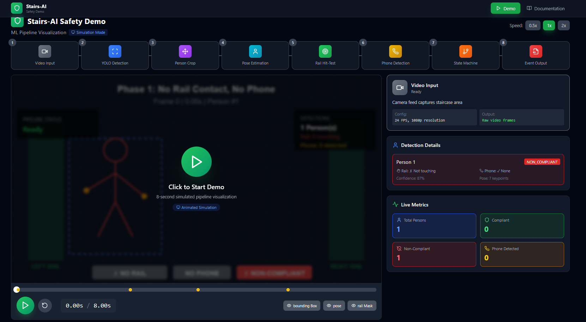

# 🎬 Stairs-AI Demo

> **Interactive ML Pipeline Visualization for Staircase Safety Monitoring**

[](https://YOUR_USERNAME.github.io/stairs-ai-demo/)
[](LICENSE)
[](https://www.typescriptlang.org/)
[](https://react.dev/)

An **interactive, real-time visualization** of a complete computer vision safety monitoring pipeline—from YOLO detection through MediaPipe pose estimation to compliance event generation. Built to showcase ML transparency and pipeline explainability.



---

## 🎯 What This Demonstrates

This system proves technical capability across the full computer vision stack:

| Component | Technology | Evidence |
|-----------|-----------|----------|
| **Object Detection** | YOLOv8n | Real-time person bounding boxes with confidence scores |
| **Pose Estimation** | MediaPipe | 33-landmark skeleton with wrist/ear keypoint tracking |
| **Spatial Analysis** | Polygon Hit-Testing | Point-in-polygon rail contact detection |
| **Heuristic Detection** | Distance Metrics | Phone usage detection via wrist-to-ear proximity |
| **State Management** | Debounced FSM | 0.55s debounce preventing detection flicker |
| **Event System** | Structured Logging | JSON events with evidence frame snapshots |
| **Real-Time UI** | React + TypeScript | Interactive pipeline visualization with live metrics |

---

## 🏗️ System Architecture

```
┌─────────────────────────────────────────────────────────────────┐
│                        VIDEO INPUT                               │
│                    8-second sample @ 24fps                       │
└────────────────────────┬────────────────────────────────────────┘
                         │
                         ▼
┌─────────────────────────────────────────────────────────────────┐
│                    PYTHON ML PIPELINE                            │
├─────────────────────────────────────────────────────────────────┤
│  1. YOLOv8 Detection    → Person bounding boxes                 │
│  2. Crop & Resize       → Isolated person images                │
│  3. MediaPipe Pose      → 33 skeleton keypoints                 │
│  4. Rail Hit-Test       → Wrist in handrail zone?               │
│  5. Phone Heuristic     → Wrist-to-ear distance < 0.05?         │
│  6. State Machine       → Debounced compliance transitions      │
│  7. Event Logger        → JSON events + evidence frames         │
└────────────────────────┬────────────────────────────────────────┘
                         │
                         ▼
┌─────────────────────────────────────────────────────────────────┐
│                    STATIC PAYLOAD                                │
├─────────────────────────────────────────────────────────────────┤
│  • frame_packets.json   → Per-frame detection data              │
│  • events.json          → Compliance state changes              │
│  • summary.json         → Aggregate statistics                  │
│  • evidence_frames/     → SVG snapshots of key events           │
│  • storyboard.json      → Key moment thumbnails                 │
└────────────────────────┬────────────────────────────────────────┘
                         │
                         ▼
┌─────────────────────────────────────────────────────────────────┐
│                   REACT WEB INTERFACE                            │
├─────────────────────────────────────────────────────────────────┤
│  • Interactive Demo     → Real-time simulation with overlays    │
│  • EventTimeline        → Visual compliance timeline            │
│  • PersonCropStrip      → Multi-person analysis grid            │
│  • FrameViewer          → Zoomable evidence inspection          │
│  • Live Metrics         → Compliance/phone detection stats      │
└─────────────────────────────────────────────────────────────────┘
```

---

## 📁 Project Structure

```
stairs-ai-demo/
├── 📦 assets/
│   └── preview.mp4              # 8-second demo video (1280×720 @ 24fps)
│
├── 🐍 tools/                    # Python ML Pipeline
│   ├── utils/
│   │   ├── types.py             # Type definitions for all data structures
│   │   ├── masks.py             # Rail polygon hit-test manager
│   │   ├── pose.py              # MediaPipe pose estimation wrapper
│   │   ├── phone.py             # Phone detection heuristics
│   │   ├── state_machine.py    # Debounced state transitions
│   │   ├── overlay.py           # OpenCV visualization utilities
│   │   ├── events.py            # Event logging and evidence capture
│   │   └── io.py                # JSON/JSONL serialization
│   ├── run_demo.py              # Main inference pipeline
│   ├── extract_storyboard.py    # Chapter thumbnail extraction
│   └── make_static_site_payload.py  # Generate web payload
│
├── ⚛️  web/                     # React Frontend
│   ├── public/
│   │   └── demo/                # Generated static payload
│   │       ├── events.json
│   │       ├── frame_packets.json
│   │       ├── summary.json
│   │       ├── evidence_frames/
│   │       └── storyboard/
│   ├── src/
│   │   ├── lib/
│   │   │   ├── types.ts         # TypeScript type definitions
│   │   │   ├── format.ts        # Formatting utilities
│   │   │   └── demoData.ts      # Data loading hooks
│   │   ├── pages/
│   │   │   └── InteractiveDemo.tsx  # Main demo page
│   │   ├── components/
│   │   │   ├── EventTimeline.tsx    # Visual timeline bar
│   │   │   ├── PersonCropStrip.tsx  # Multi-person grid
│   │   │   ├── FrameViewer.tsx      # Zoomable image viewer
│   │   │   ├── MetricsCard.tsx      # Metric display cards
│   │   │   └── JsonViewer.tsx       # JSON data inspector
│   │   ├── App.tsx
│   │   └── main.tsx
│   ├── package.json
│   ├── vite.config.ts
│   └── tailwind.config.js
│
├── 📄 rail_masks.json           # Handrail polygon coordinates
├── 📋 requirements.txt          # Python dependencies
├── 🚀 .github/workflows/        # GitHub Actions CI/CD
│   └── deploy.yml               # Auto-deploy to GitHub Pages
└── 📖 README.md
```

---

## 🚀 Quick Start

### Prerequisites

- **Python 3.10+** (with pip)
- **Node.js 18+** (with npm)
- **Git** (for deployment)

### 1. Clone Repository

```bash
git clone https://github.com/YOUR_USERNAME/stairs-ai-demo.git
cd stairs-ai-demo
```

### 2. Run Python Pipeline (Optional)

```bash
# Install Python dependencies
pip install -r requirements.txt

# Run inference pipeline
python tools/run_demo.py --video assets/preview.mp4 --output web/public/demo

# Extract storyboard thumbnails
python tools/extract_storyboard.py
```

> **Note:** Pre-generated output is already included in `web/public/demo/`

### 3. Run Web Interface

```bash
cd web
npm install
npm run dev
```

Open browser to **http://localhost:3000/stairs-ai-demo/**

### 4. Build for Production

```bash
cd web
npm run build
```

Output will be in `web/dist/` ready for deployment.

---

## 🎮 Interactive Demo Features

### 🎥 **Video Simulation Player**
- Real-time animated simulation showing 4 compliance phases
- **Phase 1:** No rail contact, no phone → **NON-COMPLIANT**
- **Phase 2:** Rail contact, no phone → **COMPLIANT** ✅
- **Phase 3:** Rail contact + phone → **NON-COMPLIANT**
- **Phase 4:** No rail contact + phone → **NON-COMPLIANT**

### 📊 **Pipeline Visualization**
- 8-stage pipeline cards showing active processing step
- Hover tooltips with configuration details
- Real-time stage progression indicator

### 🎯 **Detection Details Panel**
- Per-person compliance status cards
- Rail contact indicators (✓ / ✗)
- Phone detection alerts (📱)
- Confidence scores and pose keypoint counts

### 📈 **Live Metrics Dashboard**
- Total persons detected
- Compliant count (green)
- Non-compliant count (red)
- Phone detection count (yellow)

### 📅 **Interactive Timeline**
- Visual compliance bar (green/red)
- Phone detection bar (orange)
- Event markers with click-to-view
- Chapter headers for key moments
- Seekable timeline scrubber

### 👥 **Person Analysis Grid**
- Multi-person detection cards
- Border color indicates compliance status
- Status badges for rail contact (🤚) and phone (📱)
- Confidence scores and bbox dimensions

### 🔍 **Evidence Frame Viewer**
- Click any event to open modal
- Zoomable evidence frames (0.5x - 3x)
- Download button for evidence snapshots
- Full event metadata display

### ⚙️ **Playback Controls**
- Play/Pause with large centered button
- Speed controls (0.5x, 1x, 2x)
- Reset to beginning
- Toggle overlays (bounding box, pose, rail mask)

---

## 🛠️ Technology Stack

### Frontend
- **React 18** - UI framework
- **TypeScript 5** - Type-safe development
- **Vite 5** - Build tool and dev server
- **Tailwind CSS 3** - Utility-first styling
- **Lucide Icons** - Icon library
- **React Router 6** - Client-side routing

### Backend (Pipeline)
- **Python 3.10+** - Core language
- **OpenCV** - Video processing
- **YOLOv8 (Ultralytics)** - Object detection
- **MediaPipe** - Pose estimation
- **NumPy** - Numerical operations
- **Shapely** - Polygon geometry

### Deployment
- **GitHub Pages** - Static hosting
- **GitHub Actions** - CI/CD automation
- **Vite Build** - Production optimization

---

## 📦 Data Flow

### Input Data
```
assets/preview.mp4  (8 seconds @ 24fps = 192 frames)
```

### Pipeline Output
```json
// frame_packets.json - Per-frame detection data
{
  "frame_number": 42,
  "timestamp_sec": 1.75,
  "metrics": {
    "total_persons": 1,
    "compliant_count": 1,
    "non_compliant_count": 0,
    "phone_count": 0
  },
  "persons": [...]
}

// events.json - State change events
{
  "event_id": "evt_002",
  "event_type": "compliant_start",
  "timestamp_sec": 2.5,
  "person_id": 1,
  "evidence_frame_path": "evidence_frames/frame_000060_compliant_start.svg"
}

// summary.json - Aggregate statistics
{
  "total_duration_sec": 8.0,
  "total_frames": 192,
  "total_events": 4,
  "compliance_rate": 0.37
}
```

---

## 🚢 Deployment

### GitHub Pages (Automated)

1. **Push to GitHub:**
```bash
git add .
git commit -m "Initial commit"
git push origin main
```

2. **Enable GitHub Pages:**
- Go to repository Settings → Pages
- Source: GitHub Actions
- The workflow will auto-deploy on push

3. **Access Live Demo:**
```
https://YOUR_USERNAME.github.io/stairs-ai-demo/
```

### Manual Build

```bash
cd web
npm run build
# Output in web/dist/ - deploy to any static host
```

---

## 📊 Pipeline Configuration

Edit `rail_masks.json` to adjust handrail detection zones:

```json
{
  "left_rail": {
    "polygon": [[30, 80], [90, 80], [90, 320], [30, 320]],
    "color": [34, 197, 94]
  },
  "right_rail": {
    "polygon": [[550, 80], [610, 80], [610, 320], [550, 320]],
    "color": [34, 197, 94]
  }
}
```

Adjust debounce timing in `tools/utils/state_machine.py`:

```python
DEBOUNCE_TIME = 0.55  # seconds
```

---

## 📝 License

MIT License - See [LICENSE](LICENSE) file for details.

---

## 🤝 Contributing

This is a portfolio demonstration project. For inquiries or collaboration:

- **GitHub Issues:** Report bugs or request features
- **Pull Requests:** Improvements welcome

---

## 🎓 Educational Use

This project demonstrates:
- Computer vision pipeline architecture
- Real-time pose estimation integration
- State machine design for temporal smoothing
- React component architecture
- TypeScript type safety in ML workflows
- Static site generation from ML outputs

Perfect for:
- ML portfolio presentations
- Computer vision education
- React + TypeScript learning
- CI/CD demonstration

---

## 🔗 Related Resources

- [YOLOv8 Documentation](https://docs.ultralytics.com/)
- [MediaPipe Pose](https://google.github.io/mediapipe/solutions/pose.html)
- [React Documentation](https://react.dev/)
- [Vite Guide](https://vitejs.dev/guide/)
- [Tailwind CSS](https://tailwindcss.com/)

---

**Built with ❤️ for transparent, explainable AI systems**
