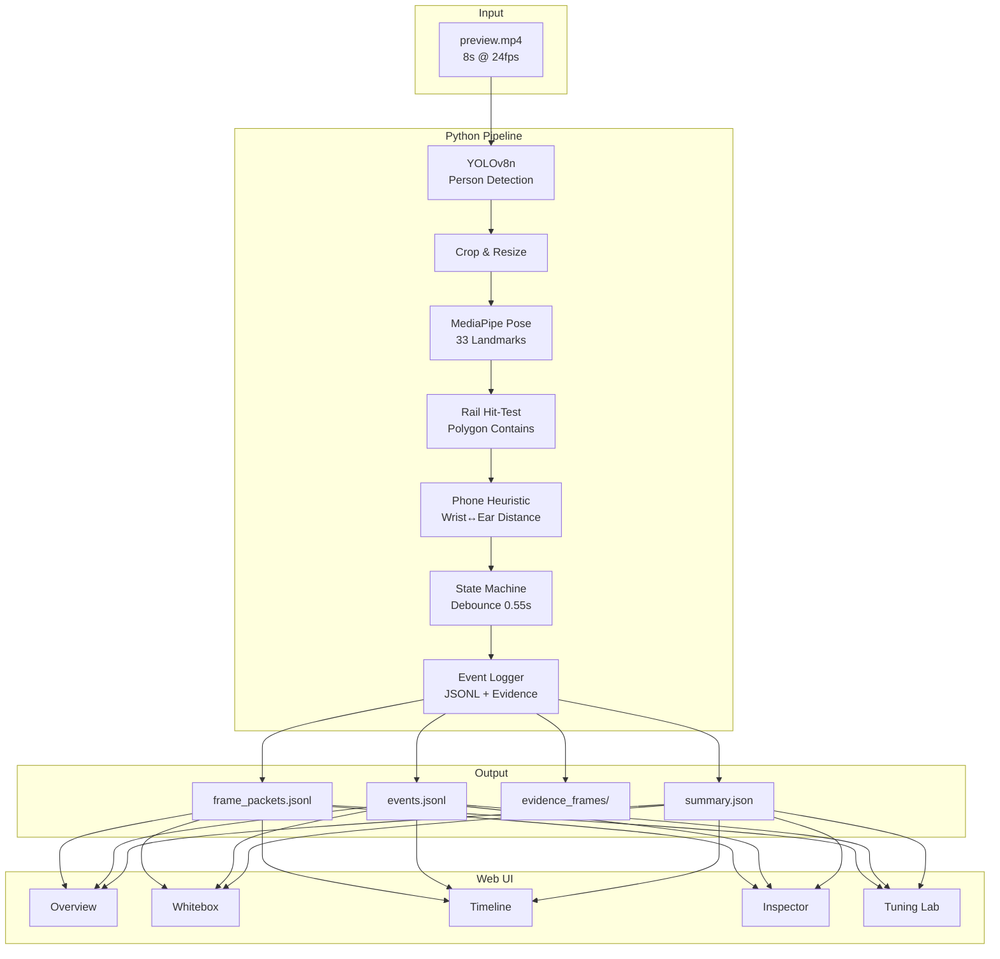
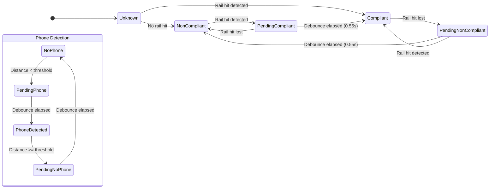

# Stairs-AI Demo

> **Portfolio-grade, GitHub Pages–deployable demo system for Unilever Smart Staircase Safety monitoring**

[](https://github.com/YOUR_USERNAME/stairs-ai-demo/actions/workflows/deploy.yml)
[](LICENSE)

A complete **whitebox AI demonstration** that shows every step of the computer vision pipeline—from YOLO detection through MediaPipe pose estimation to state machine debouncing. Built for transparency and explainability.

## 🎯 What This Proves

| Capability | Evidence |
|------------|----------|
| **YOLO Detection** | Person bounding boxes with confidence scores |
| **Pose Estimation** | 33-landmark skeleton overlay via MediaPipe |
| **Rail Compliance** | Polygon hit-test for handrail zones |
| **Phone Detection** | Wrist-to-ear distance heuristic |
| **State Machine** | Debounced transitions preventing flicker |
| **Event Logging** | Structured JSONL with evidence frames |

## 🏗️ Architecture



## 📁 Repository Structure

```
stairs-ai-demo/
├── assets/
│   ├── preview.mp4           # 8-second demo video (1280×720 @ 24fps)
│   └── screenshots/          # README images
├── tools/
│   ├── utils/
│   │   ├── types.py          # Dataclasses for all pipeline types
│   │   ├── masks.py          # RailMaskManager with polygon hit-test
│   │   ├── pose.py           # MediaPipe wrapper
│   │   ├── phone.py          # Wrist-to-ear phone heuristic
│   │   ├── state_machine.py  # Debounce logic
│   │   ├── overlay.py        # CV2 drawing utilities
│   │   ├── events.py         # Event logging
│   │   └── io.py             # JSON/JSONL utilities
│   ├── run_demo.py           # Main inference pipeline
│   ├── extract_storyboard.py # Chapter thumbnail extraction
│   └── make_static_site_payload.py
├── web/
│   ├── public/
│   │   └── demo/             # Generated static payload
│   ├── src/
│   │   ├── lib/              # TypeScript types & utilities
│   │   ├── pages/            # React page components
│   │   └── components/       # Reusable UI components
│   ├── package.json
│   └── vite.config.ts
├── rail_masks.json           # Handrail polygon definitions
├── requirements.txt          # Python dependencies
└── README.md
```

## 🚀 Quick Start

### Prerequisites

- Python 3.10+
- Node.js 18+
- FFmpeg (optional, for video processing)

### One-Command Pipeline

```bash
# Clone and setup
git clone https://github.com/YOUR_USERNAME/stairs-ai-demo.git
cd stairs-ai-demo

# Create Python environment
python -m venv venv
venv\Scripts\activate  # Windows
# source venv/bin/activate  # Linux/macOS

# Install dependencies
pip install -r requirements.txt

# Run inference pipeline (processes assets/preview.mp4)
python tools/run_demo.py

# Extract storyboard thumbnails
python tools/extract_storyboard.py

# Convert to static site payload
python tools/make_static_site_payload.py

# Start web UI
cd web
npm install
npm run dev
```

Open http://localhost:3000 to view the demo.

## 🖥️ Web UI Pages

### Overview (`/`)
Landing page with metrics summary, storyboard chapters, and architecture diagram.

### Whitebox (`/whitebox`)
Step-by-step pipeline visualization:
1. **Raw Frame** → 2. **YOLO Detection** → 3. **Person Crop** → 4. **Pose Estimation** → 5. **Rail Hit-Test** → 6. **Phone Heuristic** → 7. **State Machine** → 8. **Final Output**

### Timeline (`/timeline`)
Visual timeline showing compliance states, phone detection events, and chapter markers.

### Inspector (`/inspector`)
Frame-by-frame JSON viewer with expandable sections for metrics, persons, and state machine data.

### Tuning Lab (`/tuning`)
Interactive parameter adjustment:
- **Phone Threshold**: 0.01 – 0.15 (default: 0.05)
- **Debounce Duration**: 0.1s – 2.0s (default: 0.55s)

Compare baseline vs. tuned results in real-time.

## ⚙️ Configuration

### Rail Masks (`rail_masks.json`)

```json
{
  "left_rail": [[50, 200], [150, 200], [150, 600], [50, 600]],
  "right_rail": [[1130, 200], [1230, 200], [1230, 600], [1130, 600]],
  "frame_width": 1280,
  "frame_height": 720
}
```

### Key Parameters

| Parameter | Default | Description |
|-----------|---------|-------------|
| `yolo_conf` | 0.50 | YOLO confidence threshold |
| `phone_threshold` | 0.05 | Normalized wrist-to-ear distance |
| `min_state_duration_sec` | 0.55 | Debounce window for state changes |

## 🔧 State Machine



## 🚀 Deployment

### GitHub Pages (Recommended)

1. Fork this repository
2. Enable GitHub Pages in Settings → Pages → Source: GitHub Actions
3. Push to `main` branch
4. Access at `https://YOUR_USERNAME.github.io/stairs-ai-demo/`

The workflow automatically:
- Builds the Vite app
- Deploys to GitHub Pages
- Configures correct base path

### Manual Build

```bash
cd web
npm run build
# Output in web/dist/
```

## 📊 Output Files

| File | Description |
|------|-------------|
| `frame_packets.jsonl` | Per-frame analysis data (metrics, persons, state) |
| `events.jsonl` | State transition events with evidence |
| `summary.json` | Aggregate statistics |
| `evidence_frames/` | JPEG snapshots at event boundaries |
| `preview_annotated.mp4` | Video with overlaid detections |

### Event Types

- `non_compliant_start` – Person stopped holding rail
- `compliant_start` – Person started holding rail
- `phone_detected` – Phone-to-ear pose detected
- `phone_ended` – Phone lowered

## ⚠️ Known Limitations

> **These are intentionally demonstrated in the demo video:**

| Limitation | Visible In Demo |
|------------|-----------------|
| Partial occlusion affects pose accuracy | Frame 3.2s – arm behind body |
| Fast motion causes detection flicker | Frame 1.8s – quick movement |
| Single-camera blind spots | N/A in frontal view |
| Debounce delay in state updates | Frame 2.5s – 0.55s lag visible |

## 🔬 Algorithm Details

### Phone Heuristic

```python
def detect_phone_usage(pose, threshold=0.05):
    distances = [
        dist(left_wrist, left_ear),
        dist(left_wrist, right_ear),
        dist(right_wrist, left_ear),
        dist(right_wrist, right_ear),
    ]
    min_dist = min(distances)
    return min_dist < threshold
```

Distances are normalized by the shoulder width for scale invariance.

### Rail Hit-Test

Uses ray-casting algorithm for point-in-polygon test:
```python
def point_in_polygon(x, y, polygon):
    # Cast ray to the right, count intersections
    # Odd count = inside, even = outside
```

## 📝 License

MIT License – see [LICENSE](LICENSE) for details.

## 🙏 Acknowledgments

- [Ultralytics YOLO](https://github.com/ultralytics/ultralytics) – Object detection
- [MediaPipe](https://mediapipe.dev/) – Pose estimation
- [Vite](https://vitejs.dev/) + [React](https://react.dev/) – Web framework
- [Tailwind CSS](https://tailwindcss.com/) – Styling
- [Lucide](https://lucide.dev/) – Icons

---

**Built with 💙 for Unilever Smart Factory Initiative**
